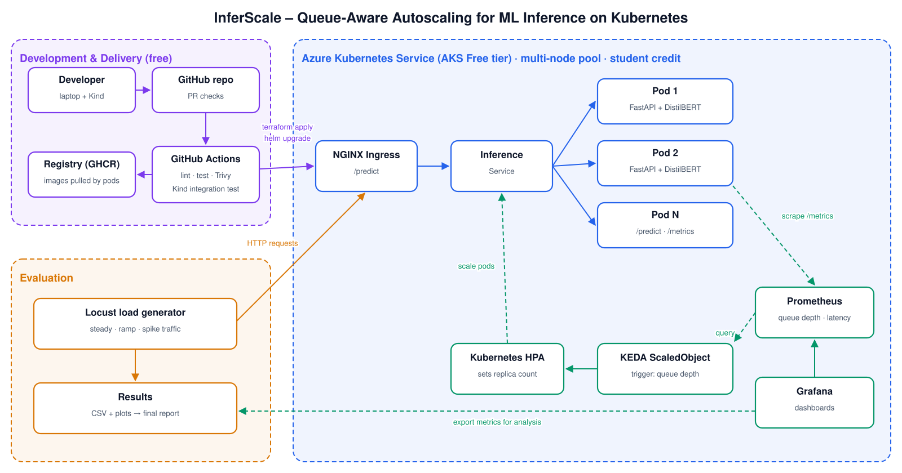
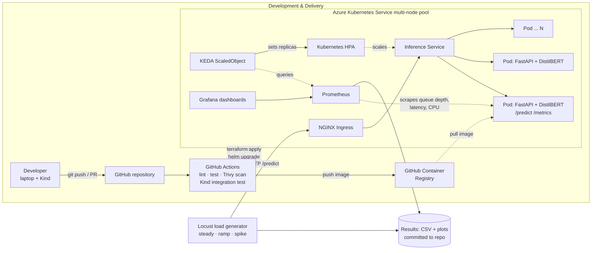

# Project Proposal – InferScale: Queue-Aware Autoscaling for ML Inference on Kubernetes

|                  |                                                                        |
| ---------------- | ---------------------------------------------------------------------- |
| **Course:**      | COMP 488 – Cloud Computing, DevOps, and AI                             |
| **Team Members** | - *Khaja Shabbir Ahmed* – Cloud / DevOps Engineer (solo project)       |
| **Contact**      | <kahmed5@luc.edu>                                          |
| **Instructor**   | Gregor von Laszewski                                                   |
| **Repository**   | https://github.com/cloudmesh-ai-luc/shabbir04                          |
| **Date**         | *Sept. 23 2026* (draft v0.2)                                           |

---

## 1. Title

**InferScale: Queue-Aware Autoscaling for ML Inference on Kubernetes**
*(Subtitle: An automated, zero-cost cloud deployment with CI/CD and a latency-per-dollar evaluation)*

---

## 2. Executive Summary

**Problem:** Machine-learning models are increasingly served as web APIs, and their traffic is bursty.
Kubernetes usually scales these services with the Horizontal Pod Autoscaler (HPA) based on CPU usage.
For inference workloads, CPU is a lagging and indirect signal: by the time CPU is high, requests are
already waiting in line and response times have already degraded. Scaling too late breaks latency
targets; keeping extra replicas "just in case" wastes money. Teams usually pick a strategy by guesswork.

**Proposed solution:** InferScale deploys a CPU-friendly ML inference service (a DistilBERT sentiment
classifier behind FastAPI) on **Kubernetes** and makes the service report an application-level signal:
**request queue depth** (requests waiting or in progress). Using **KEDA** (Kubernetes Event-driven
Autoscaling) and **Prometheus**, the service scales on that signal instead of CPU. The project then
measures, under repeatable traffic patterns generated with **Locust**, how three strategies compare:

1. **Fixed replicas** (baseline),
2. **HPA on CPU utilization** (Kubernetes default),
3. **KEDA on queue depth** (proposed).

Everything is automated: **Terraform** provisions the cloud cluster, **Helm** packages the application,
**GitHub Actions** lints, tests, scans, builds and deploys on every change, and **Grafana** visualizes the
results. Development is local-first (Kind on a laptop, with a mock model for fast iteration); the final
experiments run on **Azure Kubernetes Service (AKS)** with a multi-node pool, so scaling out actually adds
compute capacity instead of sharing one laptop CPU.

**Cost:** The project is designed to cost **$0 out of pocket**: all tools are open source, GitHub Actions
and GitHub Container Registry are free for public repositories, and the cloud run is covered by the
**Azure for Students** credit (no credit card required).

**Benefits:**

- A measured answer to "does scaling on queue depth beat scaling on CPU for ML inference, and at what cost?"
- A reusable, fully automated template for deploying any containerized model on Kubernetes.
- Hands-on experience with Kubernetes, IaC, CI/CD, observability, event-driven autoscaling, and load testing.

---

## 3. Objectives & Success Criteria

| # | Objective | Success Metric |
| - | --------- | -------------- |
| 1 | Containerize an inference API (FastAPI) with a **mock mode** and a **real-model mode** that exports Prometheus metrics (queue depth, in-flight requests, latency histogram). | Image builds in CI; `/predict`, `/healthz`, `/metrics` pass tests in both modes; image < 1.5 GB. |
| 2 | Deploy the service with a Helm chart to a local Kind cluster. | One-command install; rolling update completes with 0 failed requests under light load. |
| 3 | Provision an AKS cluster with Terraform. | `terraform apply` builds the cluster from scratch; `terraform destroy` removes all resources cleanly. |
| 4 | Build a CI/CD pipeline in GitHub Actions. | Every pull request runs lint, unit tests, image scan, and an integration test on an ephemeral Kind cluster; merges to `main` deploy automatically. Pipeline < 10 min. |
| 5 | Add observability. | Grafana dashboard shows request rate, queue depth, p50/p95/p99 latency, error rate, replica count, CPU/memory. |
| 6 | Implement and compare three autoscaling strategies under three load patterns (steady, ramp, spike). | Report with p95 latency, error rate, scale-up reaction time, and estimated cost per 1,000 requests for all 9 combinations, each repeated 3×. |
| 7 | Demonstrate the benefit of queue-aware scaling. | Hypothesis: KEDA on queue depth reaches the same p95 latency as CPU-based HPA with fewer replica-minutes, or better p95 latency at equal cost. The result is reported either way. |

---

## 4. Scope

| In Scope | Out of Scope |
| -------- | ------------ |
| Inference API (FastAPI + Hugging Face Transformers), Docker image | Training or fine-tuning models |
| Local Kind cluster (development, CI) and one AKS cluster (experiments) | Multi-cloud, multi-region deployments |
| Terraform IaC, Helm chart, GitHub Actions CI/CD | GPU scheduling (CPU-only models) |
| HPA (CPU), KEDA (Prometheus queue-depth trigger), fixed replicas | Production SLAs and enterprise security hardening |
| Prometheus, Grafana, Locust load tests | Custom web front-end (a simple API + Grafana is enough) |
| **Stretch goals:** node autoscaling (AKS cluster autoscaler), scale-to-zero with KEDA, a small LLM (e.g., via Ollama) as a second workload | |

---

## 5. Architecture

*Source of the diagram (renders directly on GitHub):*

**How a request flows:** Locust sends requests to the NGINX Ingress, which routes them to one of the
inference pods. Each pod keeps a bounded worker pool and exposes the number of waiting and in-progress
requests (`inference_queue_depth`) on `/metrics`. Prometheus scrapes these metrics every few seconds.
KEDA queries Prometheus and, when the average queue depth per pod exceeds a threshold, raises the
replica count through the Kubernetes HPA; when the queue drains, it scales back down after a cooldown.

| Component | Technology | Notes |
| --------- | ---------- | ----- |
| Inference API | Python, FastAPI, Hugging Face Transformers (DistilBERT) | Loads in seconds on CPU; mock mode for fast local testing |
| Metrics | `prometheus_client` | Queue depth, in-flight requests, latency histogram |
| Container | Docker, GitHub Container Registry | Multi-stage build; model baked into image to reduce cold start |
| Packaging | Helm | Deployment, Service, Ingress, HPA / KEDA ScaledObject as switchable values |
| Orchestration | Kind (local, CI), Azure AKS Free tier (experiments) | 2–3 small worker nodes so scale-out adds real capacity |
| Autoscaling | Kubernetes HPA, KEDA (Prometheus scaler) | Strategy chosen per experiment via Helm values |
| IaC | Terraform (`azurerm` provider) | Resource group, AKS cluster, node pool |
| CI/CD | GitHub Actions | OIDC login to Azure (no stored cloud passwords) |
| Observability | Prometheus, Grafana | Dashboards stored as JSON in the repo |
| Load testing | Locust | Traffic profiles defined in code, reproducible |

A single YAML experiment file (model, replica limits, scaling strategy, load profile, duration) drives each
run, so any result can be reproduced with one command.

---

## 6. DevOps Pipeline

| Stage | Tool | What it does |
| ----- | ---- | ------------ |
| Source | GitHub | Protected `main` branch; pull requests must pass checks |
| Lint & unit test | ruff, pytest | Code style and API tests (mock mode) |
| Build | Docker Buildx (with layer cache) | Builds and tags the inference image |
| Security | Trivy | Fails the build on critical vulnerabilities |
| Integration test | Kind inside the GitHub runner | Installs the Helm chart on a throw-away cluster and calls `/predict` |
| Publish | GHCR | Pushes the tested image |
| Deploy | Terraform + Helm | Applies infrastructure changes; upgrades the release on AKS (only while a cluster exists) |
| Post-deploy | Smoke test | Calls `/healthz` and `/predict`; rolls back on failure |

---

## 7. Evaluation Plan

**Design:** 3 strategies × 3 load patterns = 9 configurations, each run 3 times on AKS
(plus earlier dry runs on Kind).

| Load pattern | Description |
| ------------ | ----------- |
| Steady | Constant request rate for 10 minutes |
| Ramp | Rate rises linearly from low to high over 10 minutes |
| Spike | Low baseline with sudden 5× bursts |

| Metric | How it is measured |
| ------ | ------------------ |
| p50 / p95 / p99 latency | Locust + Prometheus histogram |
| Error rate (5xx, timeouts) | Locust |
| Scale-up reaction time | Time from start of a spike to new pods `Ready` |
| Replica-minutes used | Prometheus (`kube_deployment_status_replicas`) |
| Estimated cost per 1,000 requests | Replica-minutes × Azure list price of the node size, divided by requests served |
| Scaling stability | Number of scale-up/scale-down events (detects "flapping") |

Results are exported to CSV, plotted with Python, and summarized in the final report.

---

## 8. Project Plan & Timeline (weekly)

| Week | Dates | Tasks | Milestone |
| ---- | ----- | ----- | --------- |
| 1 | Sep 21 – Sep 27 | Title, administrative fields, first draft of this proposal | Proposal v0.2 |
| 2 | Sep 28 – Oct 4 | Create repo, finalize architecture diagram, set up Kind locally, activate Azure for Students | Repo + diagram |
| 3 | Oct 5 – Oct 11 | FastAPI service (mock mode), Dockerfile, unit tests | Service runs in Docker |
| 4 | Oct 12 – Oct 18 | Real model (DistilBERT), Prometheus metrics incl. queue depth | `/metrics` working |
| 5 | Oct 19 – Oct 25 | Helm chart, deploy on Kind, NGINX Ingress | App on local Kubernetes |
| 6 | Oct 26 – Nov 1 | GitHub Actions: lint, test, Trivy, build, push to GHCR, Kind integration test | CI green |
| 7 | Nov 2 – Nov 8 | Prometheus + Grafana on Kind, dashboard | Dashboard |
| 8 | Nov 9 – Nov 15 | HPA (CPU) and KEDA (queue depth), Locust profiles, dry-run experiments on Kind | All strategies work locally |
| 9 | Nov 16 – Nov 22 | Terraform for AKS, deploy via pipeline, budget alert | Cloud deployment |
| 10 | Nov 23 – Nov 29 | Run the 9 × 3 experiments on AKS, then `terraform destroy` | Raw results |
| 11 | Nov 30 – Dec 6 | Analysis, plots, final report, README, demo video | Final report |
| 12 | Dec 7 – Dec 10 | Presentation and buffer | Final presentation |

---

## 9. Resources & Budget

**Target cost: $0 out of pocket.**

| Resource | Cost | Reason |
| -------- | ---- | ------ |
| Kind cluster on own laptop | $0 | Development, CI testing, dry runs |
| GitHub repository, Actions, Container Registry | $0 | Free for public repositories |
| Terraform, Helm, KEDA, Prometheus, Grafana, Locust, DistilBERT | $0 | Open source |
| Azure for Students subscription | $0 ($100 credit) | School email verification, no credit card |
| AKS Free tier cluster management | $0 | No control-plane fee on the Free tier |
| 2–3 small CPU worker nodes, only during experiment week | Paid from credit | Cluster created for experiments and destroyed immediately after |
| **Out-of-pocket total** | **$0** | |

Safeguards: the cluster exists only while experiments run; an Azure Cost Management budget alert warns at
50% of the credit; with no credit card attached, services stop instead of charging if the credit is used up.
If cloud access is unavailable, all experiments can still run on Kind (with the limitation that pods share
one machine's CPU), and the AKS run becomes a stretch goal.

---

## 10. Risk Management

| Risk | Likelihood | Impact | Mitigation |
| ---- | ---------- | ------ | ---------- |
| Student credit used faster than expected | Low | Medium | Destroy cluster after each session; budget alert; local fallback |
| Model too slow or large for small nodes | Medium | Medium | Use DistilBERT (small); mock mode; set Kubernetes resource requests/limits |
| Slow pod start hides scaling differences | Medium | Medium | Bake model into image; readiness probes; measure and report cold start separately |
| Autoscaling "flapping" (scaling up and down repeatedly) | Medium | Medium | KEDA cooldown and HPA stabilization windows; count scaling events as a metric |
| KEDA / Prometheus configuration difficulty | Medium | Medium | Start with CPU HPA; add KEDA step by step on Kind before moving to AKS |
| Noisy benchmark results | Medium | Medium | 3 repetitions per configuration; report mean and variation |
| Local laptop runs out of memory | Medium | Low | Mock mode; limit replicas locally; heavy runs only on AKS |

---

## 11. Deliverables

| Deliverable | Format | Due |
| ----------- | ------ | --- |
| Project proposal (this document) | Markdown in repo | Week 1, updated weekly |
| Architecture diagram | SVG + Mermaid source | Week 2 |
| Inference service + Dockerfile + tests | Source in repo | Week 4 |
| Helm chart (Deployment, Service, Ingress, HPA, KEDA ScaledObject) | Source in repo | Week 5 |
| GitHub Actions workflows | `.github/workflows/*.yml` | Week 6 |
| Grafana dashboard | JSON in repo | Week 7 |
| Terraform code for AKS | `.tf` files | Week 9 |
| Locust scripts + experiment configs | Source in repo | Week 8 |
| Experiment results | CSV + plots | Week 10 |
| Final report, README, demo video, presentation | PDF / Markdown / video / slides | Weeks 11–12 |

---

## 12. Progress Log

| Week | Progress |
| ---- | -------- |
| 1 (Sep 23) | Chose topic and title; filled in administrative fields; drafted proposal and architecture diagram. |
| 2 | |
| 3 | |

---

## 13. References

- Kubernetes documentation – Horizontal Pod Autoscaling: https://kubernetes.io/docs/tasks/run-application/horizontal-pod-autoscale/
- KEDA – Kubernetes Event-driven Autoscaling, Prometheus scaler: https://keda.sh/docs/latest/scalers/prometheus/
- Kind – Kubernetes in Docker: https://kind.sigs.k8s.io/
- Azure Kubernetes Service documentation: https://learn.microsoft.com/en-us/azure/aks/
- Azure for Students: https://azure.microsoft.com/en-us/free/students
- Terraform AzureRM provider – `azurerm_kubernetes_cluster`: https://registry.terraform.io/providers/hashicorp/azurerm/latest/docs/resources/kubernetes_cluster
- Helm: https://helm.sh/docs/
- Prometheus: https://prometheus.io/docs/ · Grafana: https://grafana.com/docs/
- Locust load testing: https://docs.locust.io/
- Hugging Face Transformers / DistilBERT: https://huggingface.co/docs/transformers/model_doc/distilbert
- J. Humble, D. Farley, *Continuous Delivery: Reliable Software Releases through Build, Test, and Deployment Automation*, Addison-Wesley, 2010.
