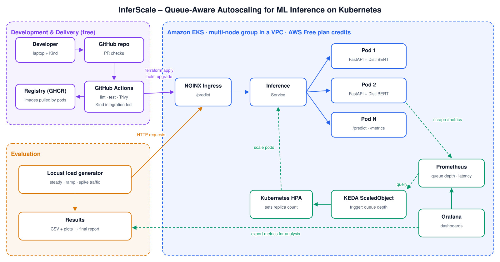
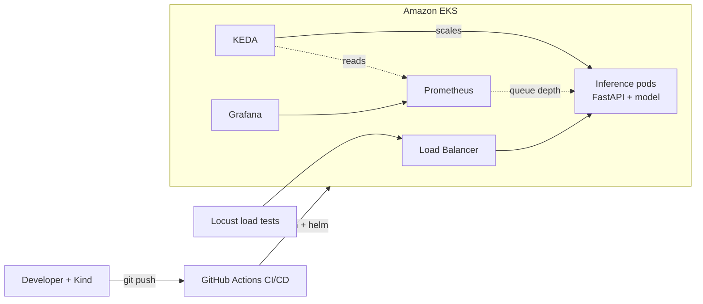

# Project Proposal – InferScale: Queue-Aware Autoscaling for ML Inference on Kubernetes

|                  |                                                                        |
| ---------------- | ---------------------------------------------------------------------- |
| **Course:**      | COMP 488 – Cloud Computing, DevOps, and AI                             |
| **Team Members** | - *Khaja Shabbir Ahmed* – Cloud / DevOps Engineer (solo project)       |
| **Contact**      | <kahmed5@luc.edu>                                                      |
| **Instructor**   | Gregor von Laszewski                                                   |
| **Repository**   | https://github.com/cloudmesh-ai-luc/shabbir04                          |
| **Date**         | *Oct. 1 2026* (initial draft)                                          |

---

## 1. Title

**InferScale: Queue-Aware Autoscaling for ML Inference on Kubernetes**

*(Working title – may be refined as the project develops.)*

---

## 2. Executive Summary (draft)

**Problem:** Machine-learning models are often served as web APIs with bursty traffic. Kubernetes
usually scales them on CPU usage, but for inference CPU is a lagging signal: by the time CPU is high,
requests are already waiting and response times have degraded. Over-provisioning avoids this but wastes
money.

**Idea:** Deploy a small ML inference service (e.g., a DistilBERT sentiment model behind FastAPI) on
Kubernetes and let it scale on **request queue depth** instead of CPU, using **KEDA** and **Prometheus**.
Then compare, under repeatable load generated with **Locust**:

1. Fixed replicas (baseline)
2. Kubernetes HPA on CPU (default)
3. KEDA on queue depth (proposed)

The deployment will be automated with **Terraform**, **Helm** and **GitHub Actions**.

**Cloud:** Development runs locally on Kind. Experiments are planned on **AWS (Amazon EKS)**, kept at
**$0 out of pocket** by using AWS Free plan credits and destroying the cluster after each session.
Chameleon Cloud is the fallback.

*(To be expanded: objectives and success criteria, scope, evaluation plan.)*

---

## 3. Architecture (initial)

```mermaid
flowchart LR
    DEV[Developer + Kind] -->|git push| GH[GitHub Actions CI/CD]
    GH -->|terraform + helm| EKS
    subgraph EKS[Amazon EKS]
        LB[Load Balancer] --> API[Inference pods<br/>FastAPI + model]
        PROM[Prometheus] -.queue depth.-> API
        KEDA[KEDA] -.reads.-> PROM
        KEDA -->|scales| API
        GRAF[Grafana] --> PROM
    end
    LOC[Locust load tests] --> LB
```

*(Diagram will be refined as components are finalized.)*

---

## 4. Planned Technologies

| Area | Technology |
| ---- | ---------- |
| Inference API | Python, FastAPI, Hugging Face Transformers |
| Container / registry | Docker, GitHub Container Registry |
| Orchestration | Kind (local), Amazon EKS (experiments) |
| Autoscaling | Kubernetes HPA, KEDA |
| IaC / packaging | Terraform, Helm |
| CI/CD | GitHub Actions |
| Observability | Prometheus, Grafana |
| Load testing | Locust |

---

## 5. Open Questions / Next Steps

- [ ] Define objectives and measurable success criteria
- [ ] Decide the evaluation metrics (latency percentiles, cost per request, scale-up time)
- [ ] Verify AWS Free plan credits and whether EKS is available on it (fallback: k3s on EC2 or Chameleon)
- [ ] Set up Kind locally and a first FastAPI prototype
- [ ] Draft a week-by-week timeline

---

## 6. Progress Log

| Week | Progress |
| ---- | -------- |
| 1 (Sep 23) | Chose topic and working title; filled in administrative fields. |
| 2 (Oct 1) | Wrote first draft of the summary; initial architecture diagram; chose AWS as target cloud with a zero-cost plan. |

---

## 7. References

- Kubernetes Horizontal Pod Autoscaling: https://kubernetes.io/docs/tasks/run-application/horizontal-pod-autoscale/
- KEDA Prometheus scaler: https://keda.sh/docs/latest/scalers/prometheus/
- Amazon EKS: https://docs.aws.amazon.com/eks/
- AWS Free Tier: https://aws.amazon.com/free/
